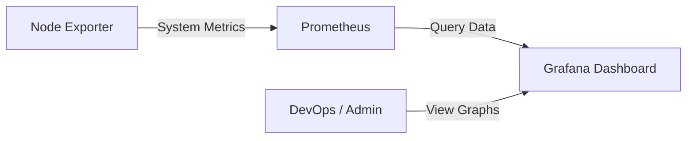

# รายงานสรุปโครงการ Qualitea: การติดตั้งระบบ Monitoring

## 1. ภาพรวมโครงการ
**Qualitea** เป็นระบบจองคิวร้านชาที่ออกแบบมาเพื่อรองรับการใช้งานพร้อมกันจำนวนมาก (High Concurrency) โดยใช้สถาปัตยกรรมแบบ Microservices บน Docker Container ซึ่งประกอบด้วย NGINX Load Balancer, PHP Application Servers, MySQL Database และระบบ Real-time WebSocket

เพื่อให้มั่นใจในเสถียรภาพและประสิทธิภาพของระบบ เราได้ทำการติดตั้งระบบ **Monitoring Stack** เพิ่มเติม เพื่อใช้ในการเฝ้าระวัง (Observability) และวิเคราะห์ปัญหาที่อาจเกิดขึ้นระหว่างการใช้งานจริงหรือการทดสอบ Load Test

## 2. โซลูชันด้าน Monitoring (Monitoring Solution)
เราเลือกใช้ **Prometheus** และ **Grafana** ซึ่งเป็นมาตรฐานอุตสาหกรรมสำหรับการจัดเก็บและแสดงผล Metrics โดยมีรายละเอียดดังนี้:

### 2.1 ส่วนประกอบหลัก (Components)
1.  **Prometheus (Metrics Server)**:
    *   ทำหน้าที่ดึงข้อมูล (Scraping) Metrics จากเป้าหมายต่างๆ ทุกๆ 15 วินาที
    *   เก็บข้อมูลในรูปแบบ Time Series Database
    *   รันอยู่ที่พอร์ต `9090`
2.  **Grafana (Visualization Dashboard)**:
    *   ทำหน้าที่ดึงข้อมูลจาก Prometheus มาแสดงผลเป็นกราฟที่สวยงามและเข้าใจง่าย
    *   ใช้สำหรับสร้าง Dashboard เพื่อดูสถานะ CPU, Memory, Network และ Application Metrics
    *   รันอยู่ที่พอร์ต `3001` (เปลี่ยนจาก Default 3000 เพื่อไม่ให้ชนกับ WebSocket Service)
3.  **Node Exporter (System Metrics Collector)**:
    *   Agent สำหรับติดตั้งบน Server เพื่อส่งข้อมูลสถานะของเครื่อง (Hardware Level) เช่น CPU Usage, RAM Available, Disk I/O, Network Traffic ไปให้ Prometheus
    *   ช่วยให้เราเห็นภาพรวมว่า Infrastructure รับภาระหนักแค่ไหน

### 2.2 โครงสร้างระบบ (Architecture)


## 3. การดำเนินการติดตั้ง (Implementation Details)

### 3.1 การปรับปรุง Docker Compose
ได้ทำการเพิ่ม Services ลงในไฟล์ `docker-compose.yml` ดังนี้:
*   `prometheus`: เชื่อมต่อกับไฟล์คอนฟิก `prometheus.yml` และ Volume `prometheus_data`
*   `grafana`: ตั้งค่ารหัสผ่านเริ่มต้นและเชื่อมต่อกับ Volume `grafana_data` เพื่อให้ Dashboard ไม่หายเมื่อ Restart
*   `node_exporter`: ทำการ Mount `/proc` และ `/sys` จาก Host เพื่อให้อ่านค่า System จริงได้

### 3.2 การตั้งค่า Prometheus (Configuration)
สร้างไฟล์ `monitoring/prometheus/prometheus.yml` เพื่อกำหนด Job สำหรับการ Scrape ข้อมูล:
```yaml
scrape_configs:
  - job_name: 'prometheus'
    static_configs:
      - targets: ['localhost:9090']
  - job_name: 'node_exporter'
    static_configs:
      - targets: ['node_exporter:9100']
```

### 3.3 การปรับปรุง Load Testing Script
แก้ไขไฟล์ `tests/stress-test.js` ของ k6 ให้รองรับการกำหนด `BASE_URL` ผ่าน Environment Variable เพื่อความยืดหยุ่นในการทดสอบEnvironment ต่างๆ
```javascript
const BASE_URL = __ENV.BASE_URL || 'http://qualitea_nginx';
```

## 4. คู่มือการใช้งาน (Usage Guide)

### 4.1 การเริ่มต้นระบบ
```powershell
docker-compose up -d
```

### 4.2 การดูข้อมูลบน Grafana
1.  เข้าใช้งานที่ **[http://localhost:3001](http://localhost:3001)**
2.  Login ด้วย `admin` / `admin`
3.  **Add Data Source**: เลือก Prometheus และใส่ URL `http://prometheus:9090`
4.  **Import Dashboard**: ใช้ ID `1860` (Node Exporter Full) เพื่อดูสถานะเครื่องแบบละเอียดทันที

### 4.3 การทดสอบระบบด้วย Load Test
เพื่อดูการตอบสนองของกราฟ ให้ทำการยิง Load Test ด้วย k6:
```powershell
# รันผ่าน Docker (แนะนำ)
docker run --rm --network qualitea_qualitea_net -v "d:\qualitea\tests:/src" grafana/k6 run /src/stress-test.js

# หรือรันแบบ Local (ถ้ามี k6)
k6 run -e BASE_URL=http://localhost:8080 tests/stress-test.js
```

## 5. สิ่งที่คาดว่าจะได้รับ
*   **Visibility**: ทีมงานสามารถมองเห็นสถานะปัจจุบันของระบบได้แบบ Real-time
*   **Performance Tuning**: สามารถระบุจุดคอขวด (Bottleneck) ได้ง่ายขึ้นเมื่อกราฟ CPU หรือ Memory พุ่งสูงผิดปกติ
*   **Proactive Alerting**: ในอนาคตสามารถตั้งค่า Alert Manager เพื่อแจ้งเตือนเมื่อระบบมีปัญหาได้ทันที
